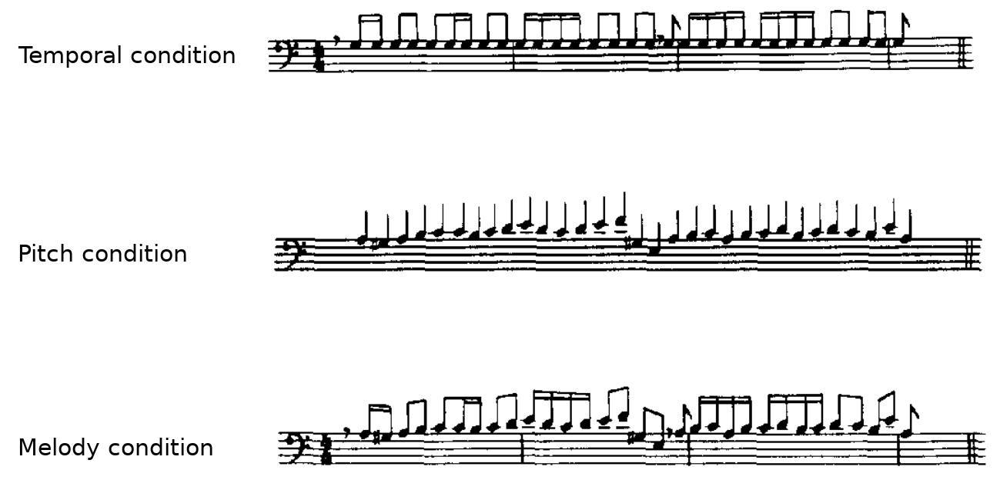
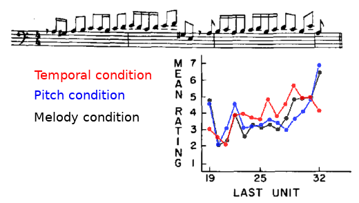
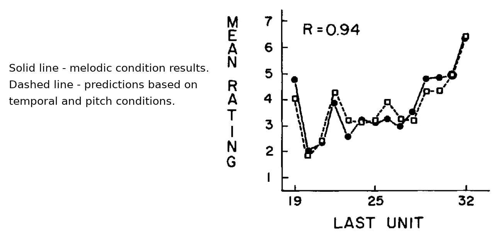
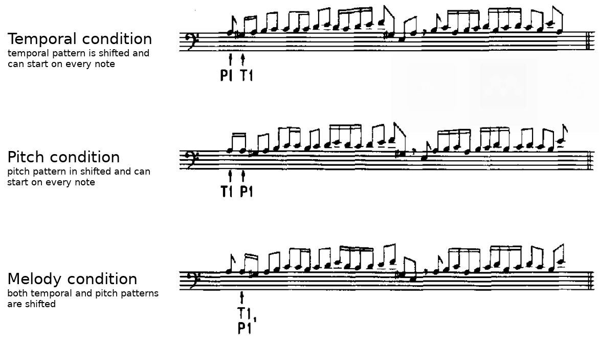
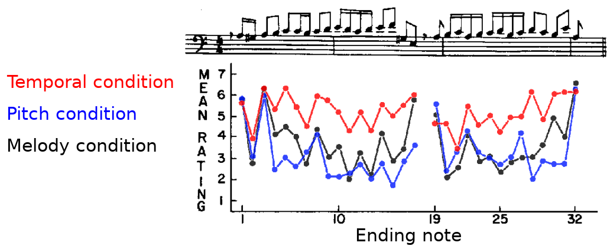
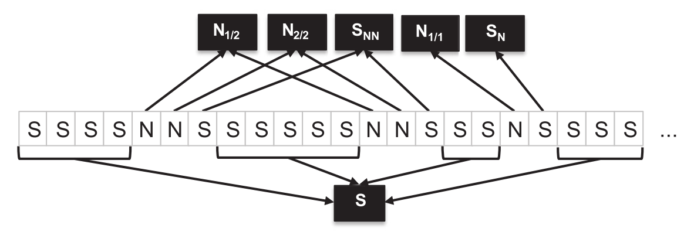
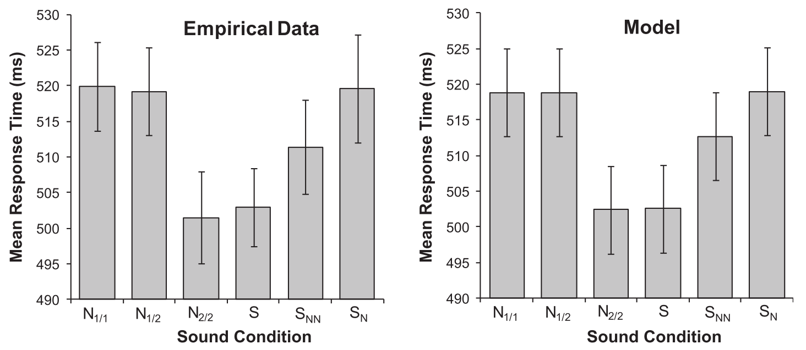

:skip-help: true
:css: static/bootstrap/css/bootstrap.min.css
:css: static/presentation.css

.. title:: Expectations in music

----

:class: main-step

Expectations in music
=====================

A presentation for the Music Perception and Cognition module (ECS741P) Queen Mary University of London

24.11.2016

Tom Gurion - PhD MAT student

----

Papers
======

**Palmer & Krumhansl 1987** Independent Temporal and Pitch Structures in Determination of Musical Phrases

**Parmentier et al. 2011** Why are auditory novels distracting? Contrasting the roles of novelty, violation of expectation and stimulus change

.. note::

  - Questions & discussion
  - Unrelated
  - Context

----

:class: main-step

Palmer & Krumhansl 1987
=======================

*Independent Temporal and Pitch Structures in Determination of Musical Phrases*

----

:data-y: r1500
:data-x: r0

Context
=======

Different models for pitch and meter:

- Lerdahl & Jackendoff 1983
- Krumhansl & Kessler 1982
- Narmour 1990
- More...

What about a unified model for melody perception?

----

**Perceptual independence vs. perceptual interaction**

  If responses to two components have zero correlation across subjects and if responses to the combined components equal the sum of responses to the individual components (performance parity), then perceptual independence of the two individual components is assumed. Perceptual interaction of a unit or whole is defined operationally as the failure to attend selectively to individual parts.

----

Research questions
==================

- How does temporal and pitch elements contribute to the perception of a melody?
- Are temporal and pitch perceptual independent?

----

Experiment 1
============

**Method**

Completeness judgment for musical phrases on a scale of 1 to 7.

.. note::

  - Musical!

----

**Stimuli**

.. raw:: html

  <audio controls="controls">
    <source type="audio/mp3" src="media/bach_bwv865.mp3"></source>
  </audio>

----

**Independent variables:**

- Condition - temporal, pitch, or melody.
- Ending note - any note from the 2nd phrase.

**Dependent variable:**

- Judgment of "completeness" of the phrase.

----

Results
=======

----

- Main effect for ending note.
- No main effect for condition.
- Significant interaction between ending note and condition.
- Significant correlation between melody and other conditions.
- No correlation between temporal and pitch conditions.
- No effect of musical background.
- Completeness judgment correlated with the predicted tonal stability of the last note (Krumhansl & Kessler 1982) for the melody and pitch conditions.

.. note::

  - Only musicians.
  - Last note.

----

**Surprisingly,**

the melody rating profile can be linearly computed from the temporal and pitch profiles!

**Conclusion:** temporal and pitch components are perceptual independent!

----

Experiment 2
============

Addresses criticism on experiment 1 design:

- Temporal and pitch condition were not musical.
- The ending note contributed too much to the judgment.
- Order of conditions (melody first) affected judgment of other conditions.

----

**Stimuli**

----

Results
=======

Results agree with experiment 1: same main effects and same model for deriving melody profile from other conditions.

----

Criticism
=========

- Reproduction with other melodies (partly addressed in Palmer & Krumhansl 1987b).
- Reproduction with measurements other than judgment of completeness (e.g. same / different with pitch or temporal deviation).

----

Discussion
==========

----

.. Back to horizontal baseline

:class: main-step
:data-x: 6400
:data-y: 0

Parmentier et al. 2011
======================

*Why are auditory novels distracting? Contrasting the roles of novelty, violation of expectation and stimulus change*

----

:data-y: r1500
:data-x: r0

Context
=======

Methods that rely on the novelty / familiarity / expectancy of stimuli:

- MMN
- Head-turning paradigm
- Reaction time
- More...

    Novel sounds are traditionally defined as rare and unexpected.

----

Research questions
==================

- What makes something novel?
- Contrasting 3 hypotheses for novelty perception.

----

1. The base-rate probability hypothesis
=======================================

  The repeated presentation of the standard sound results in the building up of a neural model with which incoming stimuli are compared.

  A rare event, by clashing with the memory trace of a frequent one, triggers the orientation of attention towards novelty.

Implies that there are no local effects.

----

2. The expectation hypothesis
=============================

  A sound should distract participants (...) whenever it violates the participant's expectation, irrespective of whether that sound is frequent or not.

  The cognitive system uses its incidental knowledge of conditional probabilities to predict future events.

Implies that expectations **do** take local events into account.

----

3. The local perceptual change hypothesis
=========================================

  Distraction should be observed whenever change occurs from one trial to the next, irrespective of the sounds involved, and regardless of their base-rate probability and predictability.

----

Experiment
==========

**Method**

Cross-modal response time:

- Presenting a standard (sine wave, 75% of the occurrences) or novel (white noise) sound.
- Visually presenting a number.
- Participants decide if the number is odd or even, as fast as possible.

----

**Novel sounds distribution**

8 out of 9 novel sounds were presented as consecutive pairs, creating 6 stimuli conditions.

----

.. class:: table table-striped thead-inverse

  +----------------+----------+---------------------+-----------+-----------------------+
  |Preceding sounds|Next sound|Base-rate probability|Expectation|Local perceptual change|
  |                |          |prediction           |prediction |prediction             |
  +================+==========+=====================+===========+=======================+
  |SS              |S         |.75                  |.81        |1                      |
  +----------------+----------+---------------------+-----------+-----------------------+
  |SS              |N         |.25                  |.19        |0                      |
  +----------------+----------+---------------------+-----------+-----------------------+
  |SN              |S         |**.75**              |**.20**    |0                      |
  +----------------+----------+---------------------+-----------+-----------------------+
  |SN              |N         |**.25**              |**.80**    |1                      |
  +----------------+----------+---------------------+-----------+-----------------------+
  |NN              |S         |.75                  |.1         |0                      |
  +----------------+----------+---------------------+-----------+-----------------------+

----

Results
=======

**The model**

A linear model of 4 parameters: the mean response time per participant, and the "distraction" for each theory (a stimuli get the value of 0 if it is predicted by the theory and 1 otherwise). The base-rate theory is insignificant for the model!

----

Criticism
=========

- The analysis use only correct responses for the digit parity test. What about incorrect responses?
- Why the expectation hypothesis "remembers" two preceding events? What about the first order?
- The model of choice. Why not linear regression of prediction profiles?
- In this case, there is no benefit of having more memory than the last notes. What about cases that require longer memory?

----

Discussion
==========
