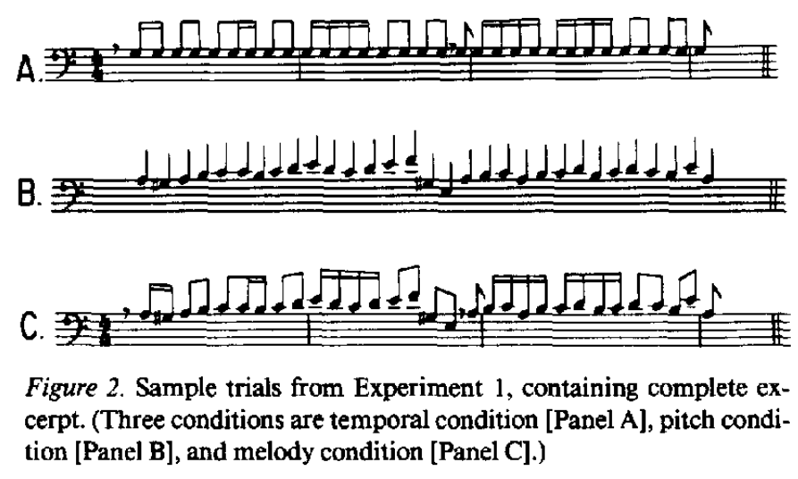
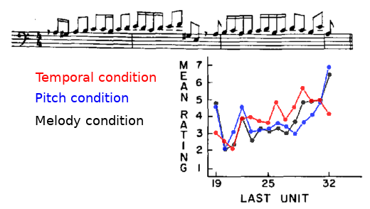
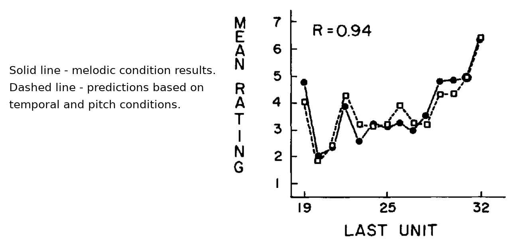
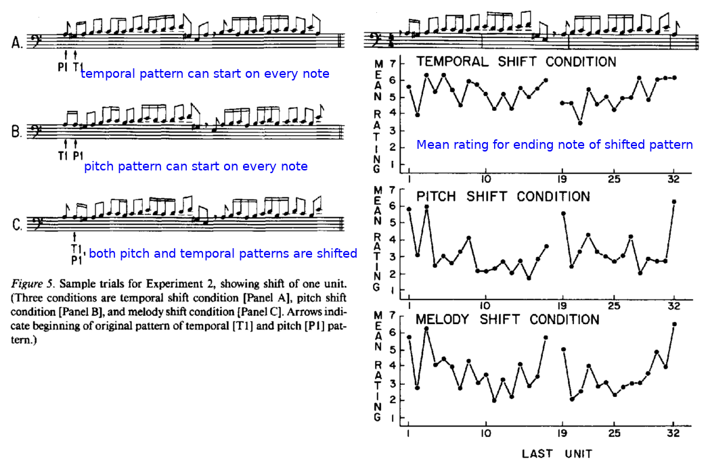
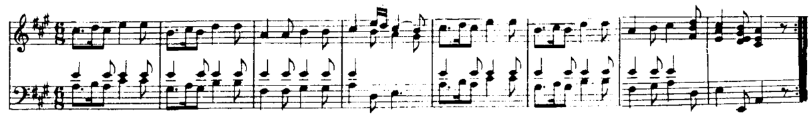

:skip-help: true
:css: static/presentation.css

.. title:: Expectations in music

----

:class: main-step

Expectations in music
=====================

Tom Gurion - PhD MAT student

----

Papers
======

**Palmer & Krumhansl 1987** Independent Temporal and Pitch Structures in Determination of Musical Phrases

**Palmer & Krumhansl 1987** Pitch and temporal contributions to musical phrase perception: Effects of harmony, performance timing, and familiarity

**Parmentier et al. 2011** Why are auditory novels distracting? Contrasting the roles of novelty, violation of expectation and stimulus change

----

Context
=======

TODO

----

:class: main-step

Palmer & Krumhansl 1987
=======================

*Independent Temporal and Pitch Structures in Determination of Musical Phrases*

----

:data-y: r1500
:data-x: r0

.. raw:: html

  <audio controls="controls">
    <source type="audio/mp3" src="media/bach_bwv865.mp3"></source>
  </audio>

----

Experiment 1
============

**Independent variables:**

- Condition - temporal, pitch, or melody.
- Ending note - any note from the 2nd phrase.

**Dependent variable:** judgment of "completeness" of the phrase on a scale of 1 to 7.

----

Results
=======

----

- Main effect for ending note.
- No main effect for condition.
- Significant interaction between ending note and condition "indicating different effects of pitch and temporal information".
- Significant correlation between melody and other conditions. No correlation between temporal and pitch conditions.

----

**Surprisingly**,

melodic rating profile can be derived algorithmically from the temporal and pitch profiles with linear regression!

----

Experiment 2
============

Addresses criticism on experiment 1 design:

- Temporal and pitch condition are not musical.
- Too much influence for the ending note.

----

----

Results
=======

In line with experiment 1.

----

:class: main-step
:data-x: 6400
:data-y: 0

Palmer & Krumhansl 1987
=======================

*Pitch and temporal contributions to musical phrase perception: Effects of harmony, performance timing, and familiarity*

----

:data-y: r1500
:data-x: r0

**Differences from previous study:**

- New musical excerpt (Mozart K. 331 piano sonata), now includes harmonic part.

.. raw:: html

  <audio controls="controls">
    <source type="audio/mp3" src="media/mozart_k331.mp3"></source>
  </audio>

- Familiarity with the musical excerpt taken into account.
- Analysis of correlations with tonal predictions from Krumhansl & Kesler 1982.
- Analysis of correlations with metrical accent predictions from Lerdahl & Jackendoff 1983.
- Analysis of correlations with time-span (grouping) predictions from Lerdahl & Jackendoff.

----

Experiment 1 results
====================

In line with experiment 1 results from the previous study. In addition:

- For familiar listeners pitch and temporal conditions correlate.
- Tonal predictions are highly correlated with pitch and combined conditions.
- Metrical accent predictions are highly correlated with temporal and combined condition for unfamiliar listeners and with temporal condition for familiar listeners.
- Time-span (grouping) predictions are highly correlated with combined condition.

----

Experiment 2 results
====================

In line with experiment 2 results from the previous study. In addition:

- Tonal predictions are highly correlated only with pitch condition for familiar listeners.
- Metrical predictions are highly correlated with temporal and combined conditions.
- Time-span predictions are highly correlated with combined condition.

Minor difference:

- Temporal condition response is now correlated with pitch condition response

----

Experiments 3 & 4
=================

Same as experiments 1 & 2 but with live performance durations. Generally, got the same results. Correlations with predictions varied.

----

Conclusions (both studies)
==========================

TODO first study conclusions.

As in Palmer & Krumhansl 1987a, with minor addition: "the relationship between pitch and temporal components differed with familiarity with the music... When one component was presented without the other, listeners familiar with the excerpt reported imagery for the missing component and tended to have higher correlations between pitch and temporal ratings than did listeners unfamiliar with the excerpt".

----

Criticism
=========

No explanations why correlations with predictions got different significance between experiments.

About stats: the authors conclude that all experiments support the same general ideas. If they were collapsing the data across experiments they will get much less significance between predictions and data, but the significant correlations will be more reliable. In general, it look like they measure significance of each correlation by it own, without balancing the measurements.

This study is more complicated than 1987a and therefore introduce more issue. Thereby, 1987a looks nicer, but maybe it's just the simplicity. Overall, 1987b have no major added value.

----

Discussion
==========

----

.. Back to horizontal baseline

:class: main-step
:data-x: 8000
:data-y: 0

Parmentier et al. 2011
======================

*Why are auditory novels distracting? Contrasting the roles of novelty, violation of expectation and stimulus change*

----

:data-y: r1500
:data-x: r0

Method
======

- Oddball tasks.

----

References to mention
=====================

- Sussman (the one that Robert covered. Check it!).
